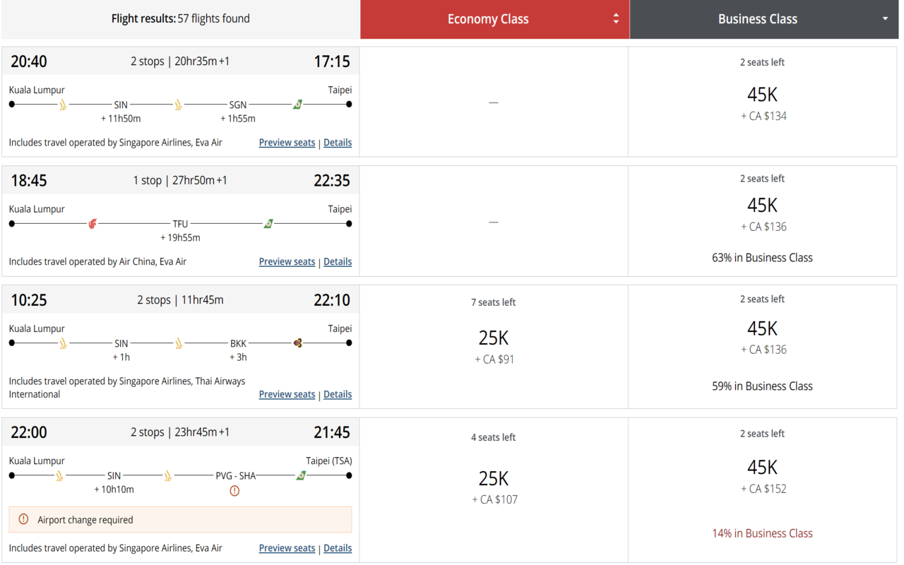

# Air Canada Display Multi Cabin Percent

A Chrome extension that always shows the mixed cabin percentage on Air Canada Aeroplan award search results — no hovering required.

[**Install from the Chrome Web Store**](https://chromewebstore.google.com/detail/air-canada-display-multi/eibgcbpgbbpghjgnhkanjgmicecgjdmf)

## What it does

When booking Aeroplan awards, Air Canada shows a "X% in Business Class" or "X% in Premium Economy" label on mixed-cabin itineraries — but only when you hover over the price cell. This extension makes those labels permanently visible so you can compare routes at a glance.

## How it works

Air Canada's own CSS already renders the label and assigns it a grid area; it's just hidden behind an `on-hover` display rule. The extension injects two CSS rules to make it always visible — no JavaScript, no performance overhead.
